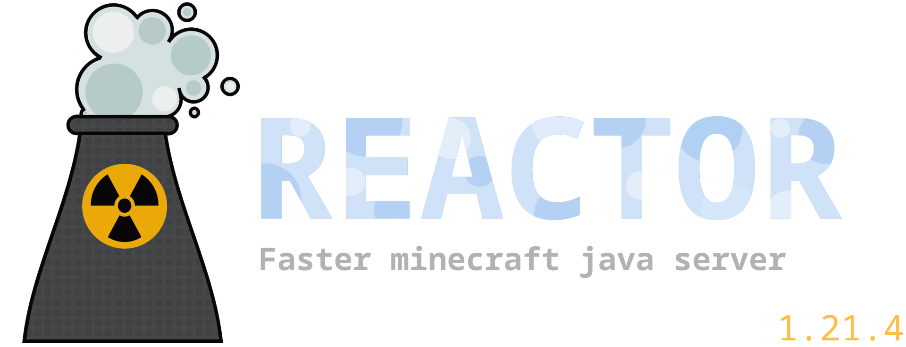

  

  <h2 align="center">Why Reactor?</h2>
  
Minecraft contains poorly written code, full of memory leaks and bad practices (not even Paper and other forks can save it). Ok, so what about Minestom? It's not a bad alternative, but it's also quite poorly programmed, and you have to code everything yourself with little to no foundation.
  

   
  

  These are the main reasons for creating Reactor—a relatively well-programmed server with high performance and a solid foundation for creating plugins (you don’t have to start everything from scratch like in Minestom).
  

  <h2>Build project</h2>
  <ol>
    <li>Download the project</li>
    <li>Execute mvn install</li>
  </ol>

> [!NOTE]
> You need java 21 for build and run the server